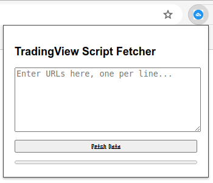

# tradingviewFetcher

> TradingView Script Fetcher

## Available Scripts

In the project directory, you can run the following scripts:

### npm dev

**Development Mode**: This command runs your extension in development mode. It will launch a new browser instance with your extension loaded. The page will automatically reload whenever you make changes to your code, allowing for a smooth development experience.

```bash
npm dev
```

### npm start

**Production Preview**: This command runs your extension in production mode. It will launch a new browser instance with your extension loaded, simulating the environment and behavior of your extension as it will appear once published.

```bash
npm start
```

### npm build

**Build for Production**: This command builds your extension for production. It optimizes and bundles your extension, preparing it for deployment to the target browser's store.

```bash
npm build
```


